<div align="center">

# 💶 Saldo

**Capire dove vanno i soldi, in modo chiaro e immediato.**

Un'app Android per il tracciamento delle spese personali, offline-first e privacy-first.
Gratuita, senza account, senza pubblicità, senza tracciamento, senza collegamento alla banca.


[**⬇️ Scarica l'ultima versione**](https://github.com/fiorenzobrioni/saldo/releases/latest)

</div>

## Cos'è Saldo

Saldo è un expense tracker, non un'app di home banking: registra spese, entrate e
trasferimenti, tiene il saldo di ogni conto (banca, carte, contanti, wallet) e mostra dove
vanno i soldi. Una spesa si registra in 2-3 tap.

Nessun collegamento ai conti bancari, nessun server, nessuna registrazione: i dati restano sul
dispositivo. Il saldo di un conto è sempre calcolato dai movimenti, mai salvato a parte.

## Schermate

<table>
  <tr>
    <td align="center" width="33%">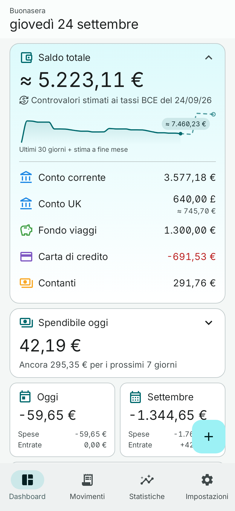<br><sub><b>Dashboard</b>: il saldo e il mese a colpo d'occhio</sub></td>
    <td align="center" width="33%">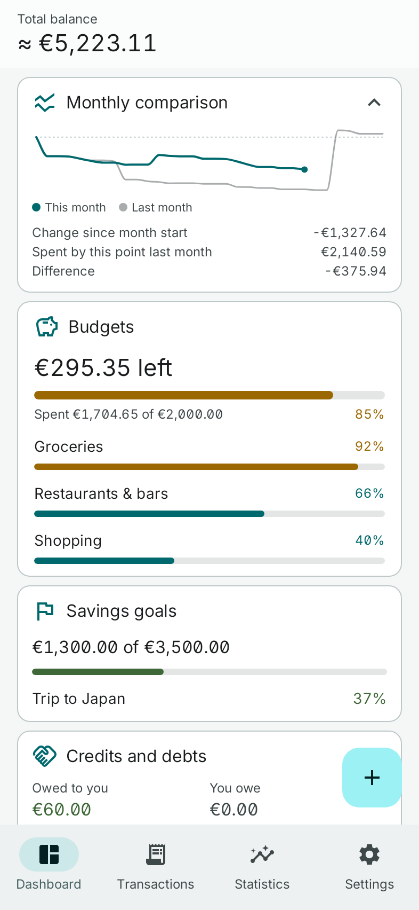<br><sub><b>Budget e obiettivi</b>, nelle schede</sub></td>
    <td align="center" width="33%">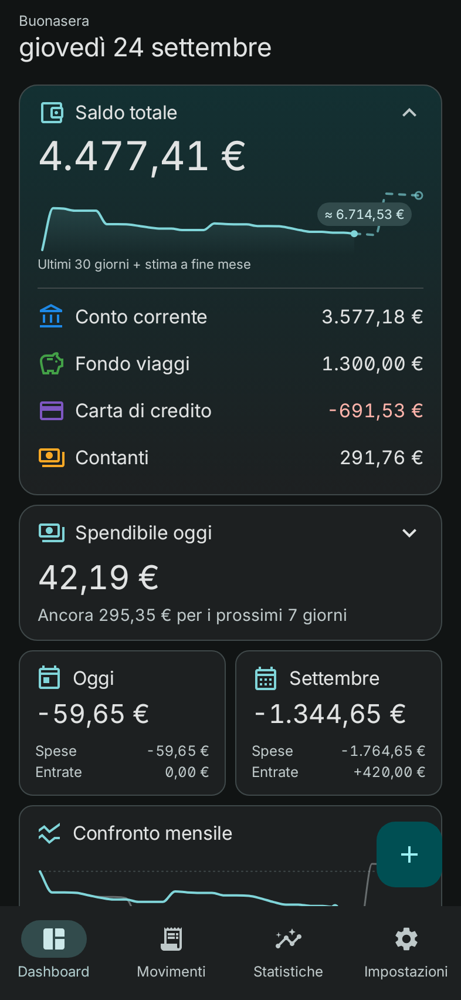<br><sub><b>Tema scuro</b></sub></td>
  </tr>
  <tr>
    <td align="center">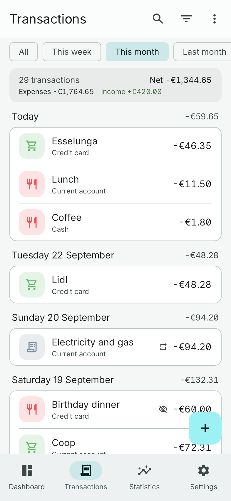<br><sub><b>Movimenti</b>, giorno per giorno</sub></td>
    <td align="center">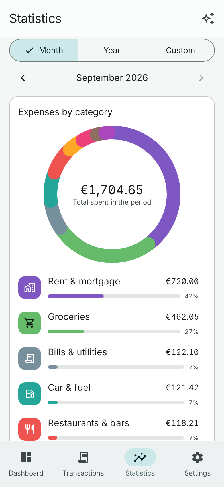<br><sub><b>Statistiche</b> per categoria</sub></td>
    <td align="center">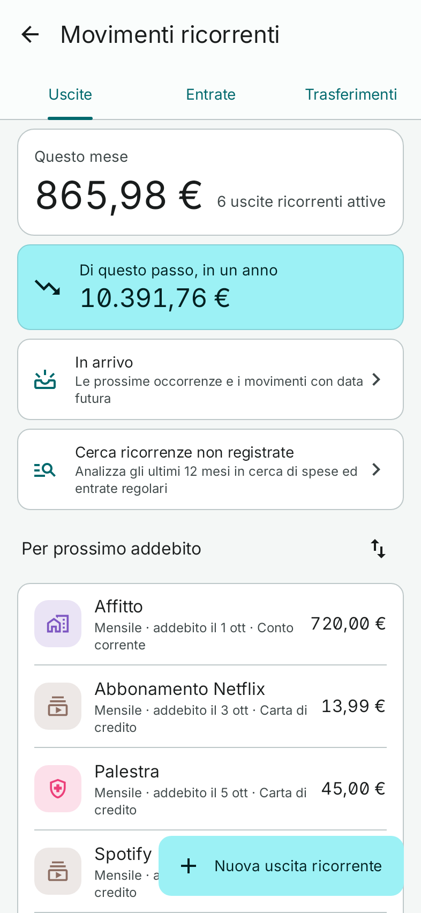<br><sub><b>Ricorrenti</b>: totale e proiezione annua</sub></td>
  </tr>
  <tr>
    <td align="center">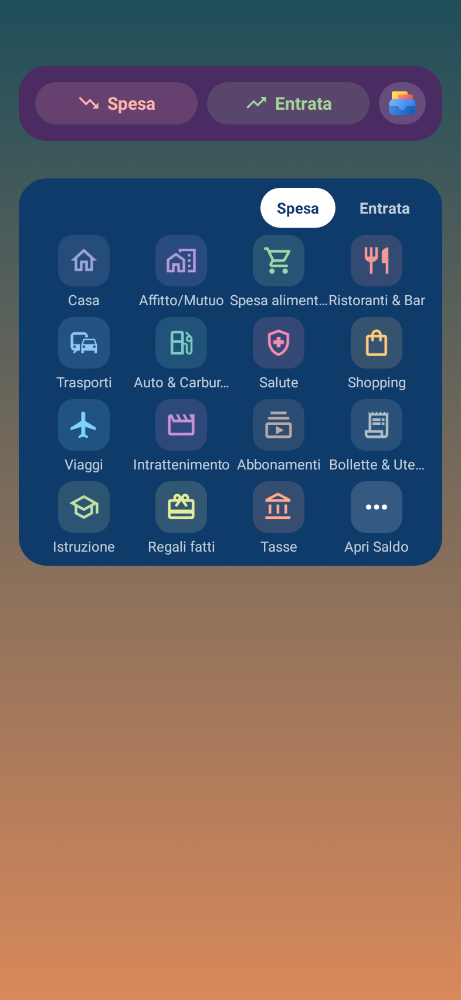<br><sub><b>Due widget</b> di aggiunta rapida</sub></td>
    <td align="center">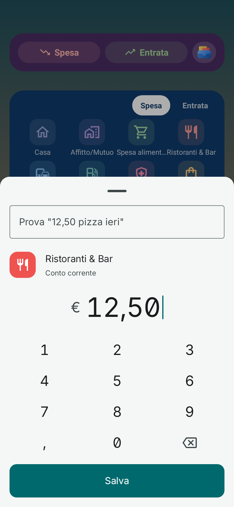<br><sub><b>Inserimento rapido</b>, senza aprire l'app</sub></td>
    <td align="center">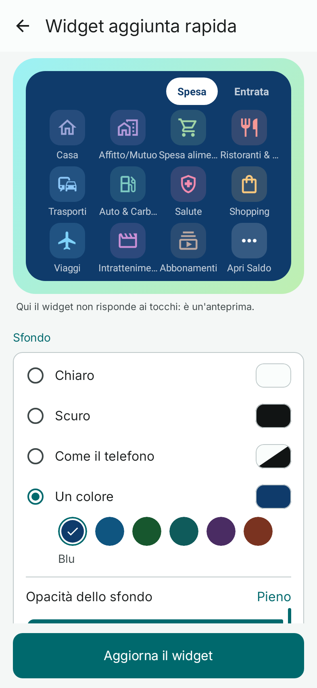<br><sub><b>Impostazioni del widget</b>, con anteprima</sub></td>
  </tr>
  <tr>
    <td align="center">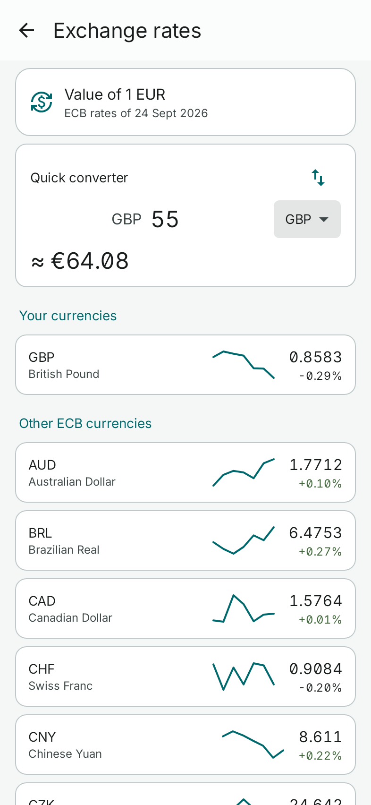<br><sub><b>Tassi di cambio</b> BCE e convertitore</sub></td>
    <td align="center">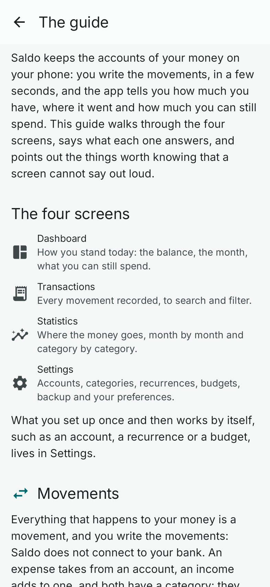<br><sub><b>La guida</b>, nell'app</sub></td>
    <td></td>
  </tr>
</table>

Disegnate dalle schermate dell'app su dati d'esempio realistici, in italiano (l'app parla anche
inglese). La barra di stato del telefono non compare. Il comando che le rigenera è in
[Build](#build).

## Funzionalità

- 📊 **Dashboard**: saldo totale con andamento e stima a fine mese, spese di oggi e del mese, ultimi movimenti.
- 💸 **Movimenti**: spese, entrate e trasferimenti in 2-3 tap, con tastierino dedicato, note, tag e duplicazione.
- 🏦 **Conti**: corrente, risparmio, prepagata, carta di credito, contanti, wallet, ognuno con la sua schermata di dettaglio.
- 💳 **Carte di credito a saldo**: ciclo di chiusura e addebito, estratto da pagare con un tap.
- 📉 **Prestiti e finanziamenti**: debito residuo, rate pagate e rate mancanti.
- 🔁 **Ricorrenti**: abbonamenti, stipendio, accantonamenti, con conferma o in automatico, e pausa.
- ⏳ **In arrivo**: movimenti futuri e occorrenze da confermare, in una sola lista.
- 💰 **Budget**: un tetto mensile e tetti per categoria, con avvisi all'80% e al 100%.
- 🟢 **Spendibile oggi**: quanto resta da spendere nel budget, con il dettaglio del calcolo.
- 🎯 **Obiettivi di risparmio**: un traguardo su un conto di risparmio, con il versamento mensile suggerito.
- 🤝 **Crediti e debiti**: soldi prestati o ricevuti da persone, fuori dalle statistiche di spesa.
- 📈 **Statistiche**: spese per categoria, trend mensile, entrate e uscite, andamento del saldo.
- ✨ **Saldo Wrapped**: il racconto del mese appena chiuso, condivisibile come immagine.
- 🌍 **Multi-valuta**: ogni movimento nella sua valuta, equivalenti stimati con i tassi BCE.
- 🏠 **Widget e Impostazioni rapide**: una spesa registrata senza aprire l'app, anche scritta in una riga ("12,50 pizza ieri").
- 💾 **Backup**: su un file tuo, anche cifrato con passphrase, con promemoria opzionale.
- 📥 **CSV**: export dei movimenti filtrati, import con riconoscimento del formato o mappatura manuale.
- 🔒 **Blocco app**: PIN, impronta o volto, contenuto nascosto nelle app recenti.
- 🔔 **Notifiche**: ricorrenze, budget, estratti carta, scadenze, in silenzio fra le 22 e le 7.
- 📖 **La guida**: le quattro schermate e quello che una schermata non può dire da sola.
- 🎨 **Aspetto**: chiaro o scuro, colori dell'app o dinamici del telefono.
- 🇮🇹 🇬🇧 **Italiano e inglese**, con il selettore di lingua per app del sistema.

Il manuale completo, una pagina per funzionalità, è in [docs/guida-utente/](./docs/guida-utente/).

## Principi

| | |
|---|---|
| 🔌 **Offline-first** | ogni funzione core funziona senza rete; senza rete i cambi BCE usano l'ultimo tasso noto |
| 🔒 **Privacy-first** | nessun dato lascia il dispositivo senza un'azione esplicita, nessuna telemetria. L'unica richiesta di rete è quella dei tassi BCE, senza dati dell'utente e disattivabile |
| 🚫 **Zero backend** | nessun server proprietario, nessun account |
| ⚡ **Zero frizione** | registrare una spesa richiede al massimo 2-3 tap |
| 🧮 **Conti esatti** | importi in centesimi e `BigDecimal`, mai numeri in virgola mobile; il saldo è sempre calcolato dai movimenti |
| 📊 **Statistiche oneste** | trasferimenti, rettifiche e prestiti a persone restano fuori dalle statistiche di spesa |

## Installazione

Android 13 (API 33) o superiore.

1. Scarica `saldo-vX.Y.Z.apk` dall'[ultima release](https://github.com/fiorenzobrioni/saldo/releases/latest).
2. Aprilo dal telefono e autorizza l'installazione da questa sorgente quando Android lo chiede.
3. Al primo avvio scegli valuta e primo conto, oppure ripristina un backup.

**Verifica del download.** Metti l'APK e il suo file `.sha256` nella stessa cartella ed esegui
`sha256sum -c saldo-vX.Y.Z.apk.sha256`. Per verificare che l'APK sia autentico, confronta il
suo certificato di firma (`apksigner verify --print-certs`, o AppVerifier sul telefono) con
questa impronta SHA-256:

```
17:6C:88:E2:21:93:87:89:71:5C:CB:65:F1:73:F2:CA:90:09:9A:BF:B6:16:55:C1:BF:FA:F4:DE:98:E8:F8:7E
```

**Aggiornamenti.** Saldo non controlla da sola se ci sono aggiornamenti: usa le notifiche
"Watch, Custom, Releases" di GitHub, oppure [Obtainium](https://github.com/ImranR98/Obtainium).
Dalla 2.2.0 ogni versione si installa sopra la precedente senza perdere i dati. Le versioni fino
alla 2.1.0 erano firmate con un'altra chiave: per passare da una di quelle serve disinstallare,
quindi prima esporta un backup e ripristinalo al primo avvio. Le note di ogni versione sono in
[docs/release-notes/](./docs/release-notes/).

## Roadmap

- **v3.0**: budget con periodo personalizzato e riporto, acquisti a rate, spesa divisa su più
  categorie, ricerca con suggerimenti.

Il piano completo, con le decisioni architetturali e le idee ancora da valutare, è in
[PLANNING.md](./PLANNING.md).

## Build

Richiede JDK 21 e l'Android SDK (Android Studio stabile va bene).

```bash
./gradlew assembleDebug                              # app/build/outputs/apk/debug/
./gradlew assembleDebug testDebugUnitTest lint detekt  # la verifica completa, come in CI
```

Per una build minificata installabile da provare:
`./gradlew assembleRelease -PsignReleaseWithDebugKey`. È firmata con la chiave di debug
committata in `keystore/`, di proposito, così le build della CI e di ogni macchina condividono
una sola firma. Le build debug hanno `applicationIdSuffix ".debug"` e si installano accanto
alla release.

La CI esegue test, lint e detekt **prima** di produrre gli APK. Un tag `vX.Y.Z` ripete la
verifica, poi pubblica l'APK firmato con la chiave di rilascio, il suo checksum e il mapping
R8, con le note di `docs/release-notes/vX.Y.Z.md` come testo della release.

Screenshot del README:
`./gradlew testDebugUnitTest -PupdateScreenshots --tests "*.ReadmeScreenshots"`.

## Stack tecnico

- **Kotlin** 2.3, **Jetpack Compose** con Material 3, Gradle 8.14 e AGP 8.13, minSdk **33**
  (Android 13), target e compile SDK **36**
- **Room** (persistenza), **DataStore** (impostazioni), **Hilt**, **Coroutines** e **Flow**, **KSP**
- **WorkManager** (ricorrenze, promemoria), **RemoteViews** (widget), **Vico** (grafici)
- **Navigation 3**, MVVM con use case solo dove c'è logica di dominio reale
- Test: JUnit 5 sulla JVM (mapper degli importi, ricorrenze, saldi, backup), JUnit 4 e Compose
  UI Test strumentati, Robolectric per gli screenshot del README

```text
Compose UI → ViewModel → Use Case → Repository → Room, DataStore, backup ed export
```

## Struttura del progetto

```text
saldo/
├── app/src/main/kotlin/com/callbackdev/saldo/
│   ├── core/
│   │   ├── common/         # utility condivise
│   │   ├── database/       # Room: entità, DAO, migrazioni
│   │   ├── designsystem/   # tema Material 3, componenti condivisi
│   │   └── domain/         # modelli e logica di dominio
│   ├── feature/            # una cartella per schermata: dashboard, transactions, accounts, ...
│   ├── navigation/         # route NavKey, scaffold, bottom bar
│   └── notifications/      # stile comune delle notifiche
├── docs/                   # guida utente, note di rilascio, screenshot
├── devlog/                 # registro storico dello sviluppo
├── tools/                  # lo script dell'icona
└── keystore/               # la chiave di debug condivisa (committata di proposito)
```

## Documentazione di progetto

| File | Contenuto |
|---|---|
| [VISION.md](./VISION.md) | il prodotto: cos'è, per chi e perché |
| [PLANNING.md](./PLANNING.md) | roadmap a fasi, decisioni architetturali (ADR), stato di avanzamento |
| [docs/release-notes/](./docs/release-notes/) | le note di ogni versione pubblicata |
| [devlog/](./devlog/) | il registro storico dello sviluppo |
| [CLAUDE.md](./CLAUDE.md) | le regole operative per lo sviluppo assistito da AI |

## La famiglia

Saldo è una di tre app essenziali con lo stesso aspetto e le stesse regole:
[Chiaro](https://github.com/fiorenzobrioni/chiaro) (meteo) e
[Passo](https://github.com/fiorenzobrioni/passo) (passi).

## Licenza

[GPL-3.0](./LICENSE) © 2026 Fiorenzo Brioni

[Inter](https://github.com/rsms/inter) sotto SIL Open Font License 1.1: vedi
[licenses/inter/OFL.txt](./licenses/inter/OFL.txt).
